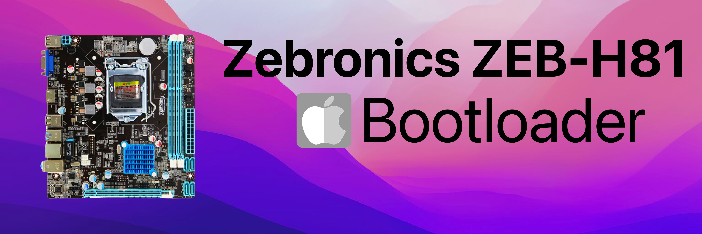

### Hardware Overview
| Description | Details |
| :-------- | :------: |
| Motherboard | Zebronics ZEB-H81 |
| Chipset | Intel® H81 |
| Processor | Intel® Core i5-4590T CPU @ 2.00GHz |
| Code Name | Products formerly Haswell |
| Processor Graphics | Intel® HD Graphics 4600 |
| RAM | 8GB 1333Mhz DDR3 |
| Audio | Realtek 662 3xAudio Jacks for 6 channel HD Audio |
| Network | Realtek 8105E 10/100 Mbps |

### BIOS Setup
| Disable | Enable |
| :------: | :-----: |
| Fast Boot | VT-x |
| Secure Boot | Hyper-Threading |
| Serial/COM Port | Execute Disable Bit |
| Parallel Port | EHCI/XHCI Hand-off |
| VT-d | OS type: Windows 8.1/10 UEFI Mode |
| CFG Lock | DVMT Pre-Allocated(iGPU Memory) 1024MB |

### Bootloader 
| Support | Version | |
| :------ | :-------------------: | :-------------: |
| Initial macOS Support | 10.13 - 12 | macOS High Sierra - macOS Monterey |
| Bootloader| 0.8.2 | **[Download](https://github.com/realtapan/macOS-Bootloader/raw/master/desktop-efi/Zebronics-ZEB-H81/zebronics-zeb-h81.md)** |
| Issue & Support | **[Discord](https://discord.gg/466jPtNZgC)** | **[Telegram](https://t.me/macEFI)** |

::: warning
After successfully installation of macOS, please change the **[SMBIOS]()** otherwise it will be pain in future.
:::
### 🛍  **Order Pre-made Desktop & Laptop [Shop Now]()** 🛒