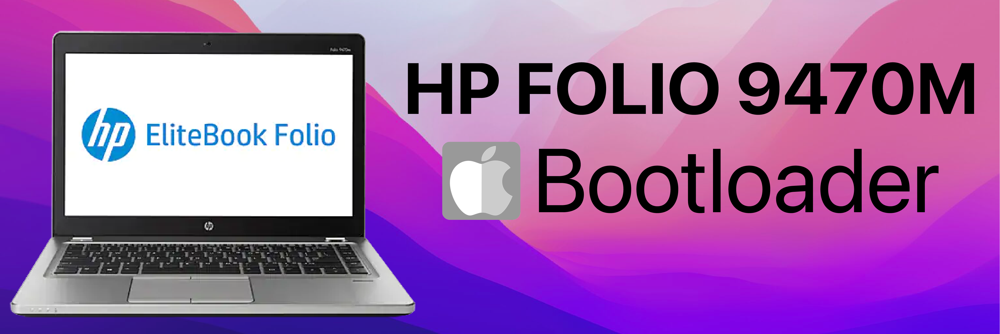

## Hardware Overview
| Description | Details |
| :-------- | :------: |
| Chipset | Intel® QM77|
| Processor | Intel® Core i5-3427U CPU @ 1.80GHz |
| Code Name | Products formerly Ivy Bridge|
| Processor Graphics | Intel® HD Graphics 4000 |
| RAM | 8GB DDR3 |
| Display | 14" LED Matte 16:9 1366x768 AU Optronics AUO253C|
| Network | Intel 82579LM Gigabit Ethernet |
|         | Intel Centrino Advanced-N 6235 802.11a/b/g/n|
|         | Bluetooth 4.0 |
| Audio | 	IDT 92HD91BXX HD Audio |
| Battery | Long Life 4-Cell, 14.8V, 52Wh (integrated) |
## BIOS Setup
| Disable | Enable |
| :------: | :-----: |
| Fast Boot | VT-x |
| Secure Boot | Hyper-Threading |
| Serial/COM Port | Execute Disable Bit |
| Parallel Port | EHCI/XHCI Hand-off |
| VT-d | OS type: Windows 8.1/10 UEFI Mode |
| CFG Lock | DVMT Pre-Allocated(iGPU Memory) MAX |
## Bootloader 
| Support | Version | |
| :------ | :-------------------: | :-------------: |
| Initial macOS Support | 10.13 - 11 | macOS High Sierra - macOS Big Sur |
| Bootloader| 0.8.2 | **[Download](https://github.com/realtapan/macOS-Bootloader/raw/master/laptop-efi/HP-Folio-9470M/EFI.zip)** |
| Issue & Support | **[Discord](https://discord.gg/466jPtNZgC)** | **[Telegram](https://t.me/macEFI)** |

::: warning
After successfully installation of macOS, please change the **[SMBIOS]()** otherwise it will be pain in future.
:::
### 🛍  **Order Pre-made Desktop & Laptop [Shop Now]()** 🛒
