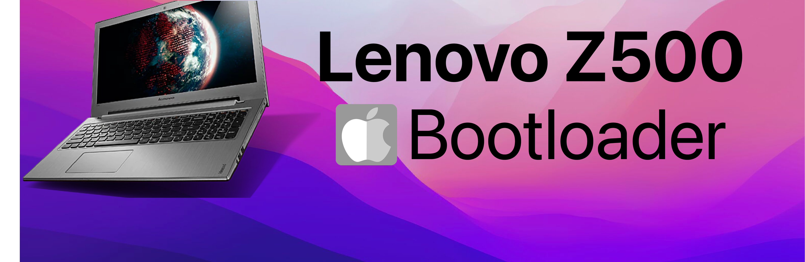

### Hardware Overview
| Description | Details |
| :-------- | :------: |
| Chipset | Intel® QM77|
| Processor | Intel® Core™ i3-3110M processor |
| Code Name | Products formerly Ivy Bridge|
| Processor Graphics | Intel® HD Graphics 4000 |
| RAM | 8GB DDR3 |
| Display | 15.6" (1366 x 768) display, 16:9 widescreen |
| Graphics | NVIDIA® GeForce® GT 635M 2GB graphics |
| Network | Realtek 8105E 10/100 Mbps |
| Audio | Realtek Audio Codec ALC662 |
### BIOS Setup
| Disable | Enable |
| :------: | :-----: |
| Fast Boot | VT-x |
| Secure Boot | Hyper-Threading |
| VT-d | OS type: Windows 8.1/10 UEFI Mode |
### Bootloader 
| Support | Version | |
| :------ | :-------------------: | :-------------: |
| Initial macOS Support | 10.13 - 11 | macOS High Sierra - macOS Big Sur |
| Bootloader| 0.8.2 | **[Download](https://github.com/realtapan/macOS-Bootloader/raw/master/laptop-efi/Lenovo-Z500/EFI.zip)** |
| Issue & Support | **[Discord](https://discord.gg/466jPtNZgC)** | **[Telegram](https://t.me/macEFI)** |

::: warning
After successfully installation of macOS, please change the **[SMBIOS]()** otherwise it will be pain in future.
:::
### 🛍  **Order Pre-made Desktop & Laptop [Shop Now]()** 🛒
