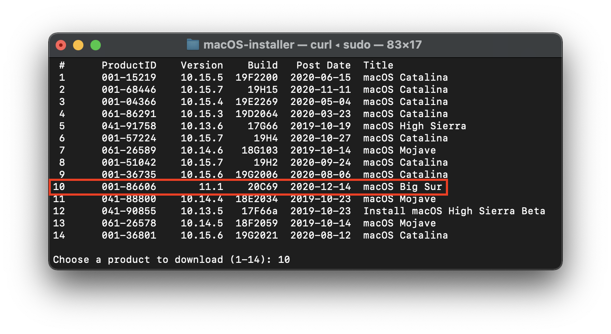
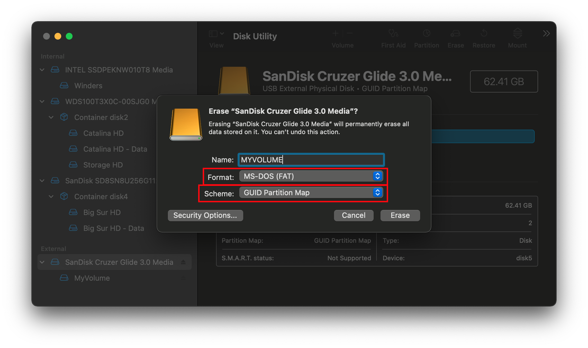

# Creating USB in macOS
To create bootable USB in macOS we need to download macOS copy first. We can download both online or offline copy.
* **Prerequisite**
  * **[Python](https://www.python.org/ftp/python/3.10.5/python-3.10.5-macos11.pkg)** 3.10.5 or above.
  * Minimum 8GB USB device for macOS 10.13 to macOS 10.15, and 16GB for macOS 11 or above.
  * For online installer 4GB USB device is enough.
## Downloading macOS: Offline
* To download macOS full installer copy the script and paste in terminal. For Online method - [Downloading macOS: Online](#downloading-macos-online)
  * ```sh
    mkdir -p ~/macOS-installer && cd ~/macOS-installer && curl https://raw.githubusercontent.com/munki/macadmin-scripts/main/installinstallmacos.py > installinstallmacos.py && sudo python installinstallmacos.py
    ```
    ::: details Users running macOS Monterey 12.3 or above
    Starting from macOS Monterey 12.3, Apple removed support for `python2.7`, so without it `installinstallmacos.py` will throw the following error:
    ```
    This tool requires the Python xattr module. Perhaps run 'pip install xattr' to install it.
    ```
    To overcome the issue, we recommend to install `Command Line Tools for Xcode` by running `xcode-select --install` in a Terminal and then run `pip3 install xattr`.

    After that you can run the command below:
    ```sh
    mkdir -p ~/macOS-installer && cd ~/macOS-installer && curl https://raw.githubusercontent.com/munki/macadmin-scripts/main/installinstallmacos.py > installinstallmacos.py && sudo python3 installinstallmacos.py
    ```
    :::
  * we get a nice list of macOS installers.
    
  * If you need a particular versions of macOS, you can select it by typing the number next to it. For this example we'll choose 10:
    
  * This is going to take a while as we're downloading the entire 8GB+ macOS installer.
  * Once finished, Click `Finder` &rarr; `Shift`+`Command`+`G` and paste `~/macOS-installer`.
  * A **.dmg** containing the macOS Installer, called `Install_macOS_11.1-20C69.dmg` for example. Mount it and you'll find the installer application.
    
  * Copy the **`Install macOS x.x.x`** to Application. (`Finder` &rarr; `Shift`+`Command`+`A`) paste.
    

## Setting up the installer
Now we'll be formatting the USB to prep for both the macOS installer and Bootloader. We'll want to use macOS Extended (HFS+) with a GUID partition map. This will create two partitions: the main MyVolume and a second called EFI which is used as a boot partition where your firmware (Bootloader) will go.
  * :::tip
    By default, Disk Utility only shows partitions – press `Command+2` to show all devices (alternatively you can press the View button)
    :::
    * Select your device &rarr; Erase &rarr; Name: `MyVolume` &nbsp; Format: `macOS Extended (Journaled)` &rarr; Scheme: `GUID Partition Map`
    
  * Next open `Terminal` and run the `createinstallmedia` command.
  ```sh
  sudo /Applications/Install\ macOS\ Big\ Sur.app/Contents/Resources/createinstallmedia --volume /Volumes/MyVolume
  ```
  :::details Other createinstallmedia Commands
  ```sh 
  # Big Sur
  sudo /Applications/Install\ macOS\ Big\ Sur.app/Contents/Resources/createinstallmedia --volume /Volumes/MyVolume
  ```
  ```sh
  # Catalina
  sudo /Applications/Install\ macOS\ Catalina.app/Contents/Resources/createinstallmedia --volume /Volumes/MyVolume
  ```
  ```sh
  # Mojave
  sudo /Applications/Install\ macOS\ Mojave.app/Contents/Resources/createinstallmedia --volume /Volumes/MyVolume
  ```
  ```sh
  # High Sierra
  sudo /Applications/Install\ macOS\ High\ Sierra.app/Contents/Resources/createinstallmedia --volume /Volumes/MyVolume
  ```
  :::
* Wait until all the files get copied from Installer to your USB device.
## Downloading macOS: Online
* To download online installers is super easy, first grab a copy of **[macrecovery.py](https://github.com/realtapan/macrecovery/archive/refs/tags/V.0.8.2.zip)** extract it open the folder.
* Open Terminal, type `cd Downloads/macrecovery-V.0.8.2` &rarr; `Enter`.
* Copy below script and paste it in terminal.
  ```sh
  # High Sierra (10.13)
  python3 ./macrecovery.py -b Mac-7BA5B2D9E42DDD94 -m 00000000000J80300 download
  ```
  ```sh
  # Mojave (10.14)
  python3 ./macrecovery.py -b Mac-7BA5B2DFE22DDD8C -m 00000000000KXPG00 download
  ```
  ```sh
  # Mojave (10.14)
  python3 ./macrecovery.py -b Mac-7BA5B2DFE22DDD8C -m 00000000000KXPG00 download
  ```
  ```sh
  # Big Sur (11)
  python3 ./macrecovery.py -b Mac-42FD25EABCABB274 -m 00000000000000000 download
  ```
  ```sh
  # Latest version
  # ie. Monterey (12)
  python3 ./macrecovery.py -b Mac-E43C1C25D4880AD6 -m 00000000000000000 download
  ```
  * Once this is done, format your USB as FAT32 with GUID Partition Scheme:
  
  * And finally, create folder on the root of this drive called com.apple.recovery.boot and place the newly downloaded BaseSystem/RecoveryImage files in:
  
## Setting up Bootloader's EFI environment
* Setting up Bootloader's EFI environment is simple – all you need to do is mount our EFI system partition.
  * Download **[MountEFI](https://github.com/corpnewt/MountEFI/archive/refs/heads/update.zip)**, unzip and run `MountEFI.command`.
  :::tip
  If the file is blocked by `Gatekeeper` or shows any warning, simply press `control` and click the file open.
  :::
  
  * Type your USB device number, an `EFI` partition will be mounted on `Desktop`.
  
  * You'll notice that once we open the EFI partition, it's empty. Here we'll put our bootloader.
  * Download your bootloader, unzip it. Copy the EFI Folder on the empty EFI partition.

### Now with all of this done, head to [Download your Bootloader](../desktop-efi/Asus-H81-M-CS/asush81m-cs.md) to finish up your work

