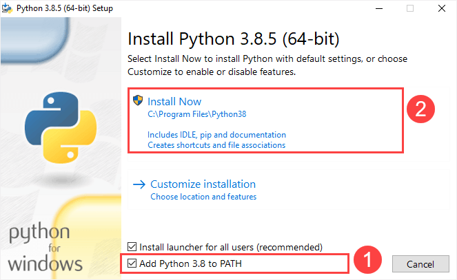
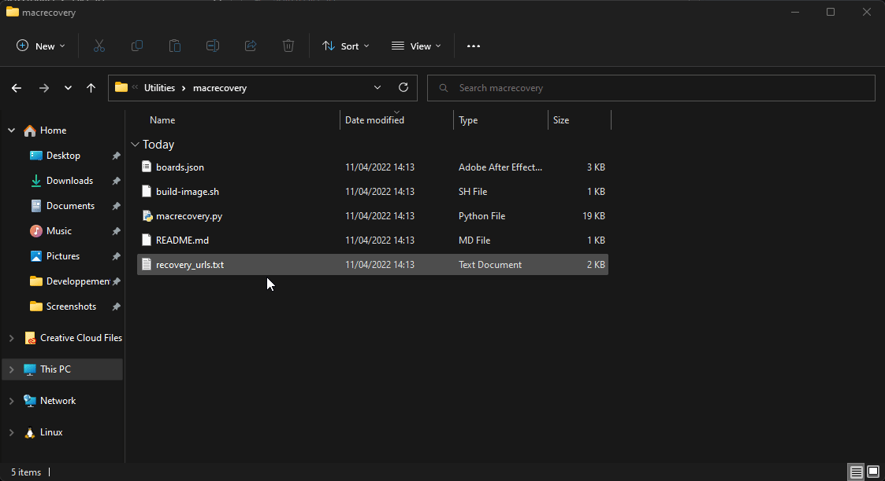
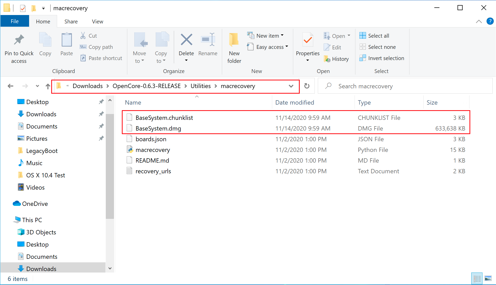
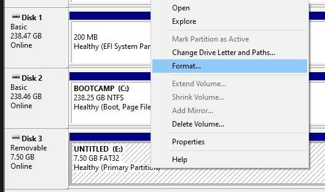
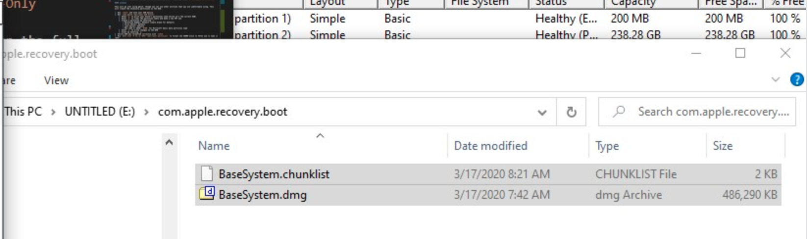

# Creating USB in Windows
To create bootable USB in Windows we need to download Online Installer first. 
* **Prerequisite**
  * **[Python](https://www.python.org/ftp/python/3.10.5/python-3.10.5-amd64.exe)** 3.10.5 or above.
     :::details Note
     
     Please check both option.
     :::
  * **[macrecovery.py](https://github.com/realtapan/macrecovery/archive/refs/tags/V.0.8.2.zip)**
  * For online installer 4GB USB device is enough.
  * For USB larger than 16 GB to format in FAT32 use [Rufus method]().
## Downloading macOS: Online
  * To download online installers is super easy, first grab a copy of **[macrecovery.py](https://github.com/realtapan/macrecovery/archive/refs/tags/V.0.8.2.zip)** extract it open the folder. Next, click next to the current folder path and type cmd to open a Command Prompt in the current directory:
  
 * Now run one of the following depending on what version of macOS you want:
   ```sh
   # High Sierra (10.13)
   python macrecovery.py -b Mac-7BA5B2D9E42DDD94 -m 00000000000J80300 download
   ```
   ```sh
   # Mojave (10.14)
   python macrecovery.py -b Mac-7BA5B2DFE22DDD8C -m 00000000000KXPG00 download
   ```
   ```sh
   # Catalina (10.15)
   python macrecovery.py -b Mac-00BE6ED71E35EB86 -m 00000000000000000 download
   ```
   ```sh
   # Big Sur (11)
   python macrecovery.py -b Mac-42FD25EABCABB274 -m 00000000000000000 download
   ```
   ```sh
   # Latest version
   # ie. Monterey (12)
   python ./macrecovery.py -b Mac-E43C1C25D4880AD6 -m 00000000000000000 download
   ```
 * This will take some time, however once you're finished you should get either BaseSystem or RecoveryImage files:
   
   | BaseSystem | RecoveryImage |
   | :---       | :---          |
   | |  |
  * Now with our installer downloaded, we'll next want to format our USB.
## Making the installer 
  Here we'll be formatting our USB and adding macOS onto it, we have 2 options:

* [Disk Management method](#disk-management-method)
  * GUI Based, simplest way
  * Only UEFI systems are supported(ex. 2012+)
* [Rufus method](#rufus-method)
  * GUI Based, simplest way
  * For larger USB drives(16GB+)

### Disk Management method

Simply open up Disk Management, and format your USB as FAT32:

1. Right click the Start Button on your task bar and select Disk Management.
2. You should see all of your partitions and disks. On the bottom half, you'll see your devices. Find your USB.
3. You'll want to format the USB to have a FAT32 partition.

* If you have multiple partitions on the USB, right click each partition and click Delete Volume for your USB (This will remove data, make sure you have backups and only remove partitions from your USB)
  * Right click the unallocated space and create a new simple volume. Make sure it is FAT32 and at least a gigabyte or two big. Name it "EFI".
* Otherwise, right click the partition on the USB and click Format and set it to FAT32.

  

Next, go to the root of this USB drive and create a folder called `com.apple.recovery.boot`. Then move the downloaded BaseSystem or RecoveryImage files. Please ensure you copy over both the .dmg and .chunklist files to this folder:




### Rufus method

1. Download [Rufus](https://rufus.ie/)
2. Set the BOOT selection as not bootable
3. Set File System as Large FAT32
4. Click Start
5. Delete all file autorun in USB Drive partition


Next, go to the root of this USB drive and create a folder called `com.apple.recovery.boot`. Then move the downloaded BaseSystem or RecoveryImage files. Please ensure you copy over both the .dmg and .chunklist files to this folder:


## Setting up Bootloader's EFI
 * Next grab your bootloader as per your hardware's configuration, unzip it copy the EFI folder and place this on the root of the USB drive along side `com.apple.recovery.boot`. Once done it should look like this:
 
 

### Now with all of this done, head to [Download your Bootloader](../desktop-efi/Asus-H81-M-CS/asush81m-cs.md) to finish up your work


